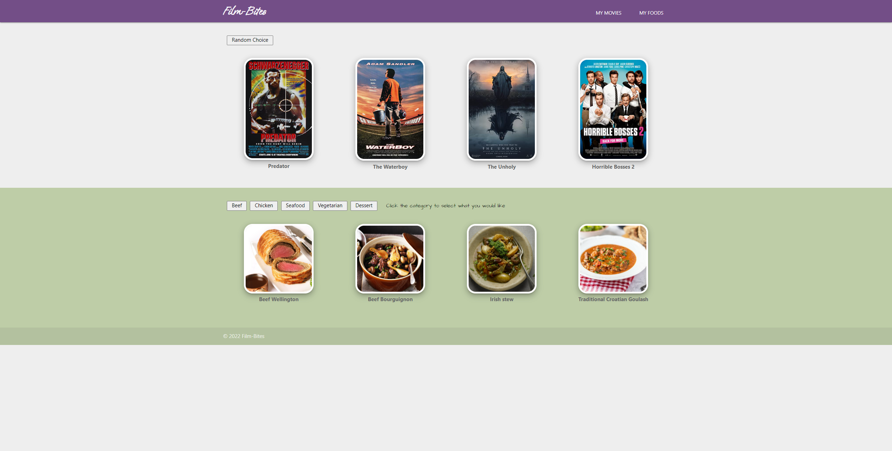

# mighty-mustangs-Project-1-Group

#Film-Bites!
Our project's title is "Film-Bites!" For this project, we created a website that displays food recipe and movie suggestions based on user input. A user is able to select prefered meal categories and be presented with random recipes based on their choice. A user is also presented with randomly selected currently popular movies. 

#Purpose 
This project gave us experience with using JavaScript, HTML, CSS, a CSS library other than Bootstrap(Materialize), and Server APIs (omdb and themealdb). 

#Usage 
To view our project (and find some new recipes and movies!) simply click the attached link and you'll be able to see the deployed project. 
https://mbarrientos1129.github.io/mighty-mustangs-Project-1-Group/

Also, here's the code for the project in our Git repository: 
https://github.com/mbarrientos1129/mighty-mustangs-Project-1-Group

#Contributing 
To access the code, access our GitHub repo titled "mighty-mustangs-Project-1-Group" (https://github.com/mbarrientos1129/mighty-mustangs-Project-1-Group). If you have any ideas of how to simplify or improve some code, please feel free to reach out! We'll continue to improve the project as we have time to work on it.

#Credits
Assistance provided by Penn LPS Coding Boot Camp/Trilogy Education Services.

#Resources 
1.) https://www.themealdb.com/
2.) http://www.omdbapi.com/
3.) https://materializecss.com/
4.) https://jquery.com/